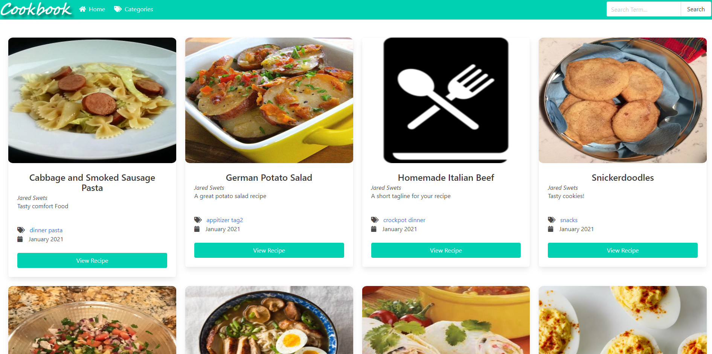
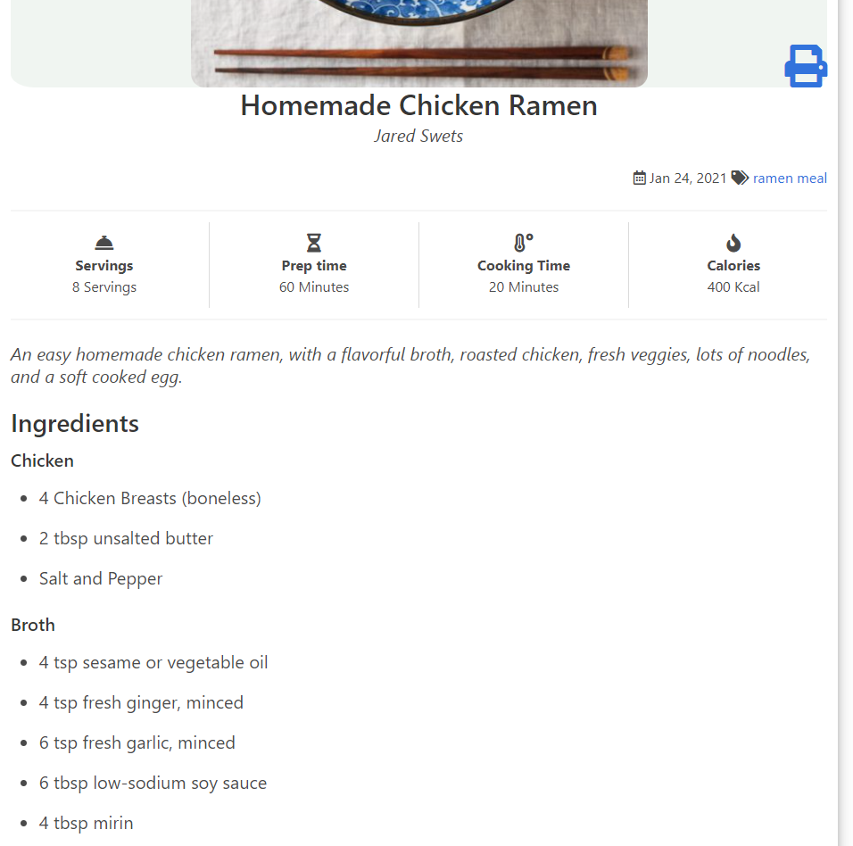
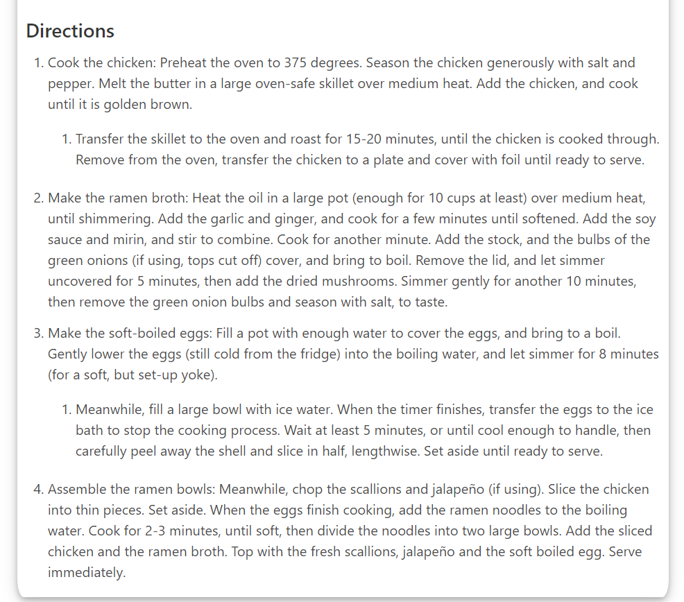

# Cookbook Theme

## About

Cookbook is a theme for hugo that stores all of your recipes and displays them in a viewable format on desktop and mobile.

Developed with Bulma CSS and UmbrellaJS (as well as fuse.js for search).

## Features

- [x] Search all your recipes.
- [x] Display cooking/cooling time, calories, servings, and prep time.
- [x] Tag your recipes, browse by tags.
- [x] Break your ingredients into subheadings.
- [x] Print view.

## Planned

- [ ] 404 page.
- [ ] More customizable print options, smaller font size for printing.
- [ ] Any other layout tweaks/feature requests.

## Install

You can install using hugo's recommended theme install method while in your hugo site directory:

`git init`

`git submodule add https://github.com/deranjer/hugo-cookbook.git themes/cookbook`

OR

You can download the latest release, or the the current master as a zip, then extract the zip file into the themes directory.

Then you can copy the `config.toml` from `exampleSite` to the root of your hugo directory, and modify that for your instance.

## Setup Default Template

Since hugo-cookbook is a single purpose theme, you need to override your default archetype so that all content created is of `recipe` type.

### Override Default

To override the default template, copy the `default.md` from `themes\archetypes\default.md` to `archetypes` and overwrite the current `default.md` in that directory.

This will ensure that any new content you create will be of type `recipe`.

## First Recipe

Simply run `hugo new recipe_name.md` to create your new recipe in the `content` folder.  Modify the markdown file as required for your new recipe.

`hugo serve` to view the site.

## Recipe Views of the Site

## Directions View

